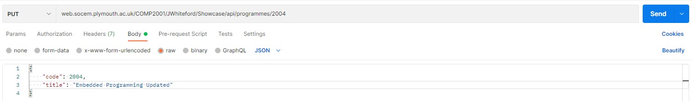
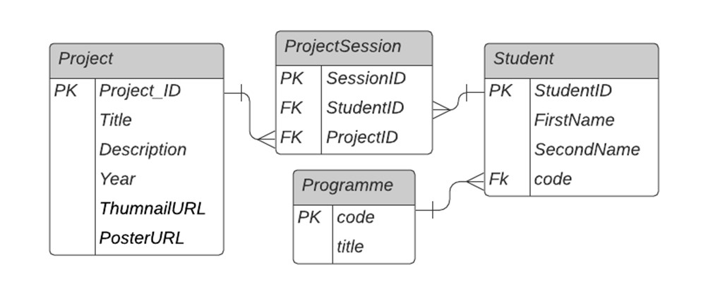

RESTfull-API
========

This is a REST API example using ASP.NET,it interacts with a SQL Server Data Base. There is no GUI as it wasnt required for the university but can be tested on Postman/Insomnia to provide interaction with the API.  

Below are some Instructions to do so if you wish.

Instructions:
- open [Postman](https://www.postman.com/downloads/)
- either download or use the browser app. You will have to create an account or sign in with google 
- create a new workspace and navigate to the Collections tab on the left
- create a new tab by clicking the + at the top left of the main window
- copy and paste this request URL web.socem.plymouth.ac.uk/COMP2001/JWhiteford/Showcase/api/programmes/ into the input field
- the API performs CREATE, READ, UPDATE and DELETE. you can try by following the instructions below

GET (READ):
- set to GET and input web.socem.plymouth.ac.uk/COMP2001/JWhiteford/Showcase/api/programmes/ to request URL box
- click send 
- it shoud return the contents of the programmes table as JSON data.

POST (CREATE):
- set to POST and input web.socem.plymouth.ac.uk/COMP2001/JWhiteford/Showcase/api/programmes/ to request URL box
- you must now enter the details you wish to post to the database. it must be in JSON format as seen in the image below

- add a code & title to the "code" & "title" fields
- click send and you should have a 201 created status
- you can check by performing a GET request as detailed above

PUT (UPDATE):
- set to PUT, but because we want to update an inividual entry this time you must add the "code" to the request URL.
- below is an example. notice the URL now has some digits at the end. This is the specific code of the data i wish to update
- 
- click send
- now you can leave the URL and just change to a GET request, click send and you should see your updated entry

DELETE
- set to DELETE and all you have to do is add the "code" of the entry you wish to delet and click send. this will delete that entry. try running a GET request on web.socem.plymouth.ac.uk/COMP2001/JWhiteford/Showcase/api/programmes and see if it has disappered

I hope you enjoyed using this API and hopfully it has helped you understand how an API works

Below is an ERD diagram of the database that was created using SQL Server. this API is only setup to deal with the Programmes table specifically.

